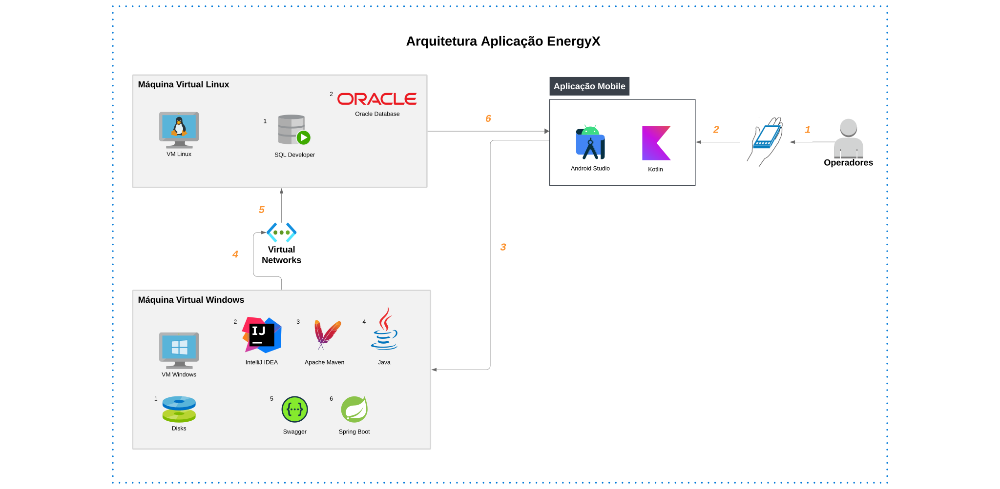

# EnergyX

## Descrição Geral do Projeto

**Projeto:** Sistema de Monitoramento e Emissão de Alertas para Operadores de Usinas Nucleares

O **Sistema de Monitoramento e Emissão de Alertas** foi desenvolvido para operadores de usinas nucleares, com o objetivo de garantir a segurança e o monitoramento constante das condições operacionais da usina. Este sistema envolve a coleta de dados em tempo real, como temperatura, pressão, radiação, e fluxo de refrigeração, com emissão de alertas para condições adversas e críticas. 

Além disso, o sistema conta com um módulo de **verificação do uso de EPIs (Equipamentos de Proteção Individual)** pelos operadores, utilizando tecnologias de deep learning e visão computacional.

## Funcionalidades

- **Aplicação Móvel**:
    - Login e Cadastro do Operador
    - Monitoramento de Temperatura, Pressão, Fluxo de Refrigeração e Níveis de Radiação
    - Status Geral (Normal, Alerta, Crítico)
    - Integração com o Sistema Backend (Java) e Banco de Dados Oracle

- **Aplicação .NET (Relatório Diário)**:
    - Login e Cadastro do Operador
    - Tela de Relatório Diário de Trabalho
    - Integração com Banco de Dados Oracle para armazenar os dados do relatório

- **Deep Learning & Visão Computacional**:
    - Reconhecimento de EPIs, como máscara, óculos, e macacão, garantindo que os operadores estejam utilizando o equipamento adequado.

## Projeto DevOps & CloudComputing
Este projeto tem como objetivo desenvolver a parte backend da nossa solução para monitoramento e gerenciamento de energia renovável, utilizando uma API construída com Java Spring Boot. O backend será hospedado em uma máquina virtual Windows, enquanto o banco de dados Oracle será configurado em uma VM Linux, ambos na Azure. A API será documentada e testada utilizando o Swagger, permitindo realizar operações CRUD (Create, Read, Update e Delete) diretamente pela interface. O foco deste estágio do projeto é garantir a implementação do backend, a persistência dos dados no banco Oracle e a validação dos endpoints da API por meio de testes interativos no Swagger.

**Etapas Principais**
 
- Configuração de Infraestrutura na Azure: Provisionar e configurar uma máquina virtual (VM) com Windows para hospedar o backend Java Spring Boot e uma VM com Linux para o Oracle Database, para conectividade entre as VMs.

- Desenvolvimento do Backend: Implementar a aplicação backend em Java Spring Boot utilizando o IntelliJ IDEA.

- Banco de Dados: Conectar ao Oracle Database para persistência de dados utilizando o SQL Developer.

- Integração e Testes de CRUD: Implementar e testar as operações CRUD (Create, Read, Update e Delete | POST, GET, UPDATE e DELETE) através do *Swagger usando o navegador Edge, garantindo que todas as funcionalidades de persistência estejam funcionando corretamente com o backend.

*Swagger: é uma ferramenta que facilita a documentação e o teste de APIs RESTful. Ele é amplamente utilizado para criar uma interface interativa e amigável onde os desenvolvedores e usuários podem testar os endpoints da API diretamente no navegador, sem a necessidade de escrever código de cliente ou usar ferramentas externas.

### Arquitetura do Projeto

### Descrição das Principais Ferramentas

**SQL Developer (Banco de Dados Oracle)**

_Motivo da Escolha:_

Ferramenta Oficial da Oracle: SQL Developer é a ferramenta oficial da Oracle para gerenciar e desenvolver bancos de dados Oracle, oferecendo suporte completo a todas as funcionalidades do Oracle Database.
Interface Amigável: Possui uma interface gráfica intuitiva para executar scripts SQL, modelar tabelas e gerenciar dados, o que facilita o trabalho de desenvolvimento e manutenção do banco de dados.
Recursos de Modelagem de Dados: Oferece ferramentas para modelagem e visualização de esquemas de banco de dados, facilitando o design da estrutura de dados.

**Fonte Confiável:** [Site oficial da Oracle](https://www.oracle.com/br/database/sqldeveloper/technologies/what-is-sql-developer/#:~:text=O%20Oracle%20SQL%20Developer%2C%20uma,cliques%20e%20pressionamentos%20de%20tecla.).

**IntelliJ IDEA (Backend Java Spring Boot)**

_Motivo da Escolha:_

Desenvolvimento Avançado: IntelliJ IDEA é amplamente reconhecida como uma das melhores IDEs para desenvolvimento em Java, oferecendo suporte completo a frameworks como Spring Boot e outras bibliotecas de desenvolvimento.
Refatoração e Análise de Código: Proporciona ferramentas de refatoração e análise de código que ajudam a manter a qualidade e a organização do projeto.
Plugins e Integração: Possui uma vasta biblioteca de plugins que permitem integrar ferramentas adicionais, como suporte a Docker, controle de versão (Git), e integração contínua.

**Fonte Confiável:** [Site Oficial JETBRAINS](https://www.jetbrains.com/pt-br/idea/)

### Sobre o Banco de Dados Oracle

**Banco de Dados para a Persistência**

Para o projeto, escolhemos o Oracle Database como a solução de banco de dados principal. A decisão foi baseada em várias características e benefícios que tornam o Oracle uma excelente opção para aplicações críticas e de grande porte, como sistemas de energia e monitoramento industrial. Abaixo, justifico os motivos para a escolha:

- **Confiabilidade e Escalabilidade**
O Oracle Database é reconhecido mundialmente por sua confiabilidade e capacidade de lidar com grandes volumes de dados. Ele é projetado para suportar operações de alta carga com segurança e estabilidade, sendo ideal para aplicações que necessitam de um desempenho consistente e sem interrupções.

- **Suporte a Transações Complexas**
O Oracle é altamente eficiente no gerenciamento de transações complexas e simultâneas, o que é essencial para um sistema que envolve processos críticos, como a monitoração em tempo real de dados e registros de operações. Ele garante consistência e integridade transacional com seu mecanismo de rollback e controle de concorrência.

- **Compatibilidade e Integração**
O Oracle Database é amplamente compatível com diversas tecnologias e linguagens de programação, incluindo Java, que será utilizado no backend do projeto. Essa compatibilidade facilita a integração e a comunicação entre a aplicação e o banco de dados, aumentando a produtividade e simplificando o desenvolvimento.

## Resumo das Instalações
| Ferramenta          | Versão Recomendada | Link de Download                                          | Passos para Instalação                                     |
|---------------------|-------------------|-----------------------------------------------------------|------------------------------------------------------------|
| **Java 17**         | 17 (LTS)          | [Oracle JDK 17](https://www.oracle.com/java/technologies/javase-jdk17-downloads.html) | Baixar, configurar **JAVA_HOME** e **PATH** no sistema    |
| **JDK 17**          | 17 (LTS)          | Já incluído no **Java 17**                                | Instalar junto com o Java, verificar com `java -version`   |
| **IntelliJ IDEA Ultimate**   | 2024.3             | [IntelliJ IDEA Ultimate 2024.3](https://www.jetbrains.com/idea/download/) | Baixar e instalar, configurar **JDK 17** no projeto       |
| **Apache Maven**           | 3.9.9             | [Maven 3.9.9](https://maven.apache.org/download.cgi)      | Baixar, extrair e configurar **MAVEN_HOME** e **PATH**     |
| **Oracle Database**      | 19c (LTS)         | [Oracle Database 19c](https://www.oracle.com/database/technologies/) | Baixar, instalar e configurar **ORACLE_HOME** e **PATH**   |
| **SQL Developer**   | 24.3              | [SQL Developer 24.3](https://www.oracle.com/tools/downloads/sqldev-downloads.html) | Baixar, extrair, apontar **JDK** e executar                |

## Apresentação em Vídeo do Projeto

[Pitch](https://youtu.be/4Arsd4bjMcM)

[Vídeo de Funcionamento do App](https://www.youtube.com/watch?v=ikUDZuAsRPo)

## Sobre o Projeto Global Solutions
A cada semestre, desenvolvemos um projeto que integra todas as disciplinas do curso de Análise e Desenvolvimento de Sistemas, com o objetivo de propor soluções para um tema de relevância global, promovido pela nossa instituição.

**Global Solutions - Tema:** Energia Renovável

Este projeto aborda soluções inovadoras e sustentáveis para questões relacionadas à energia renovável, buscando promover um impacto positivo na sociedade e no meio ambiente.

**Instituição:** FIAP - Faculdade de Informática e Administração Paulista

**Turma:** 2TDSPS

## Desenvolvedores

[Felipe Amador](https://github.com/felipetosma) | RM 553528

[Leonardo Oliveira](https://github.com/leooli-321) | RM 554024

[Sara Sousa](https://github.com/sousa-sara) | RM 552656
